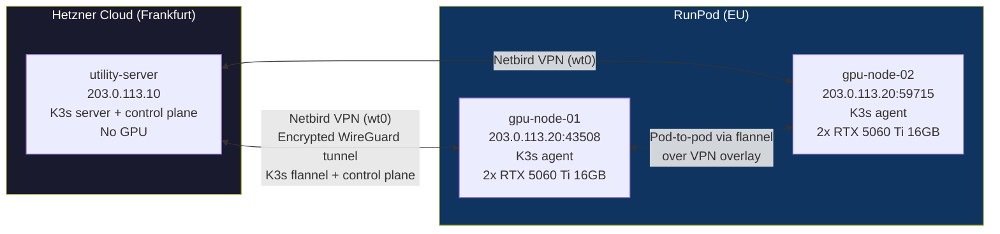
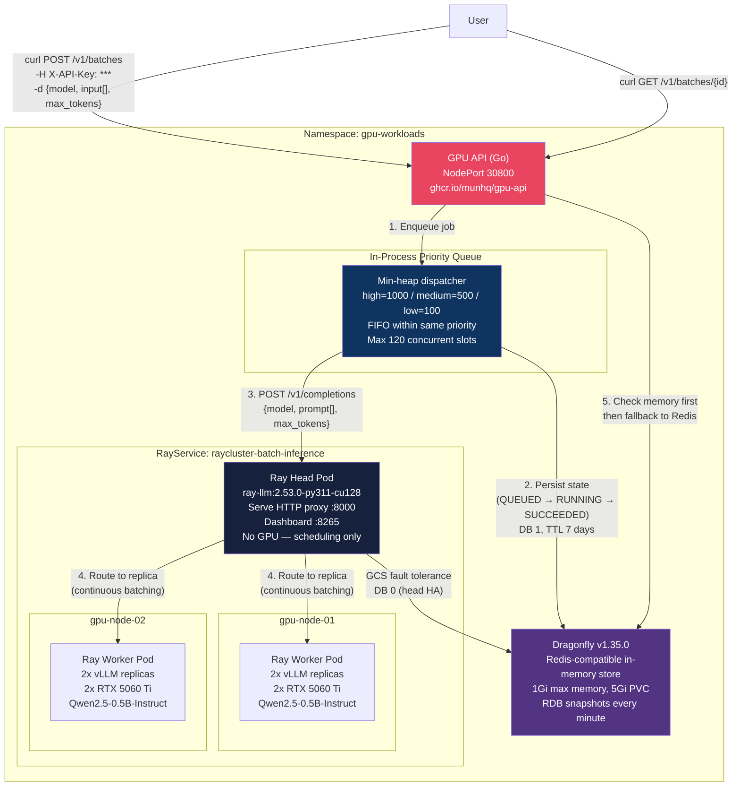
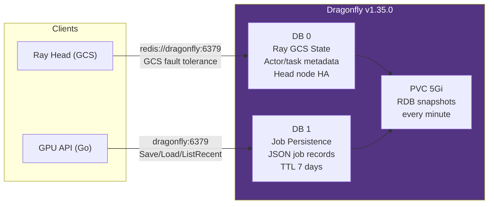
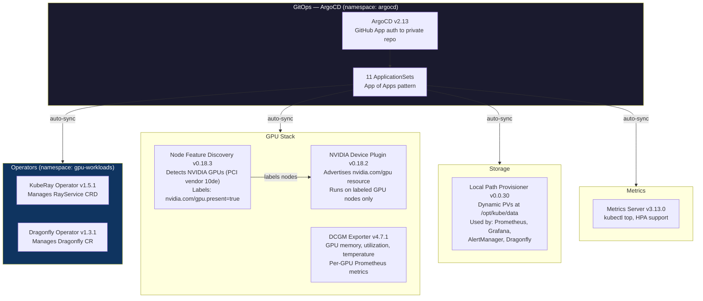
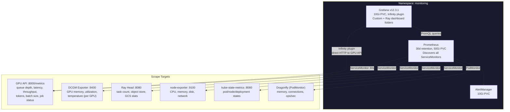
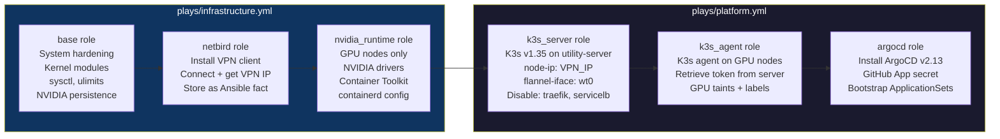
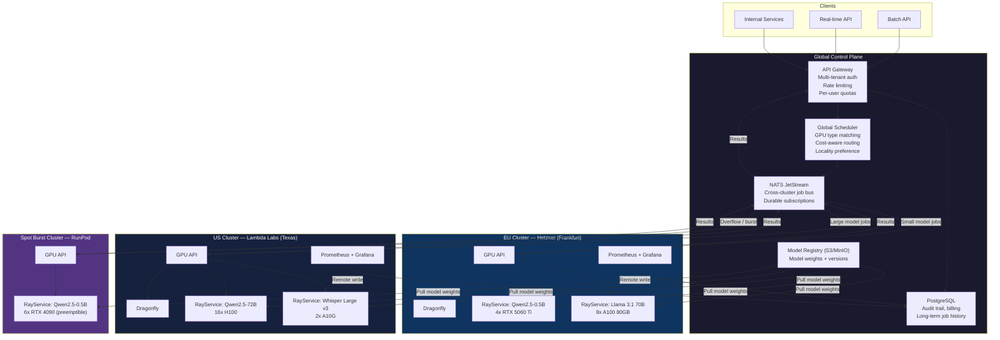

# Architecture

## Current Architecture

### Physical Topology

3 nodes across 2 providers, connected by Netbird VPN.

### Application Architecture — Request Flow

How a batch inference job moves through the system.

### Dragonfly — Dual Purpose Store

Dragonfly serves two independent roles on separate Redis databases:

### Operators & Platform Services

What runs on utility-server to support the application layer.

### Monitoring & Observability

### Infrastructure Provisioning (Ansible)

Execution order matters. Each stage depends on the previous.

### Complete Component Inventory

Every component deployed in the cluster:

| Component | Namespace | Runs On | Purpose |
|---|---|---|---|
| **K3s server** | - | utility-server | Kubernetes control plane |
| **K3s agent** | - | gpu-node-01, gpu-node-02 | Worker nodes with GPU taint |
| **ArgoCD v2.13** | argocd | utility-server | GitOps, App of Apps, GitHub App auth |
| **GPU API (Go)** | gpu-workloads | utility-server | REST API, priority queue, auth |
| **Dragonfly v1.35** | gpu-workloads | utility-server | Job persistence (DB1) + Ray GCS (DB0) |
| **Dragonfly Operator v1.3.1** | dragonfly-system | utility-server | Manages Dragonfly CR lifecycle |
| **Ray Head** | gpu-workloads | gpu-node (tolerates taint) | Serve proxy, dashboard, GCS |
| **Ray Worker x2** | gpu-workloads | gpu-node-01, gpu-node-02 | vLLM inference (2 GPU each) |
| **KubeRay Operator v1.5.1** | gpu-workloads | utility-server | Manages RayService CRD |
| **NVIDIA Device Plugin v0.18.2** | gpu-workloads | gpu-node-01, gpu-node-02 | Exposes nvidia.com/gpu resource |
| **Node Feature Discovery v0.18.3** | kube-system | all nodes | Labels GPU nodes automatically |
| **DCGM Exporter v4.7.1** | monitoring | gpu-node-01, gpu-node-02 | GPU metrics for Prometheus |
| **Prometheus** | monitoring | utility-server | Metrics collection, 30d retention |
| **Grafana v12.3.1** | monitoring | utility-server | Dashboards, Infinity plugin |
| **AlertManager** | monitoring | utility-server | Alert routing |
| **kube-state-metrics** | monitoring | utility-server | K8s object metrics |
| **node-exporter** | monitoring | all nodes | Host-level metrics |
| **Metrics Server v3.13.0** | monitoring | utility-server | Resource metrics API |
| **Local Path Provisioner v0.0.30** | kube-system | utility-server | Dynamic PV provisioning |

---

## Future Architecture — Multi-Datacenter GPU Federation

Where this could scale: multiple clusters, heterogeneous GPUs, cost-aware routing.

### Current vs Future

| Concern | Current | Future |
|---|---|---|
| **Job routing** | Single GPU API, in-process priority heap | Global scheduler, cost-aware, GPU-type matching |
| **Cross-cluster** | N/A (single cluster) | NATS JetStream job bus |
| **Storage** | Dragonfly for jobs + Ray GCS | PostgreSQL (audit/billing) + Dragonfly per cluster |
| **Models** | Single model (Qwen2.5-0.5B), hostPath | Model registry (S3), multiple models per cluster |
| **GPU types** | 4x RTX 5060 Ti (homogeneous) | RTX, A100, H100, spot (heterogeneous) |
| **Scaling** | Fixed 2 workers, 4 replicas | Per-cluster autoscaling + spot burst |
| **Networking** | Netbird VPN (3 nodes) | WireGuard mesh between clusters, Netbird within |
| **Monitoring** | Single Prometheus + Grafana | Federated Prometheus via remote write |
| **Auth** | Single API key | Multi-tenant, per-user keys, rate limits, quotas |
| **HA** | Head is SPOF, single Dragonfly | Ray GCS FT, Dragonfly replication, multi-head |
| **Cost tracking** | None | Cost-per-token, GPU-hours per job, billing |
