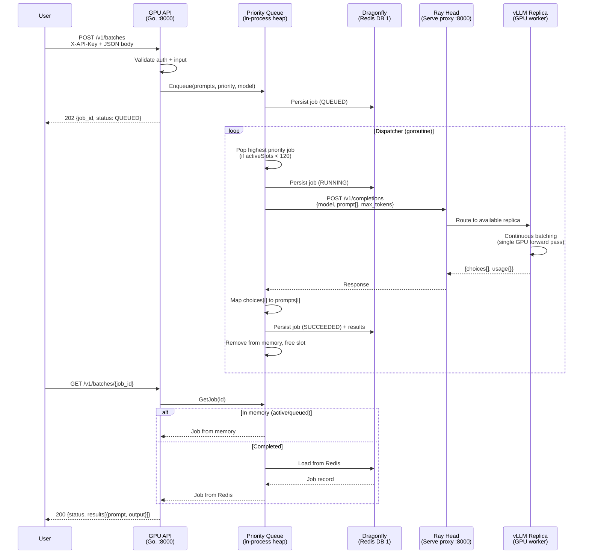
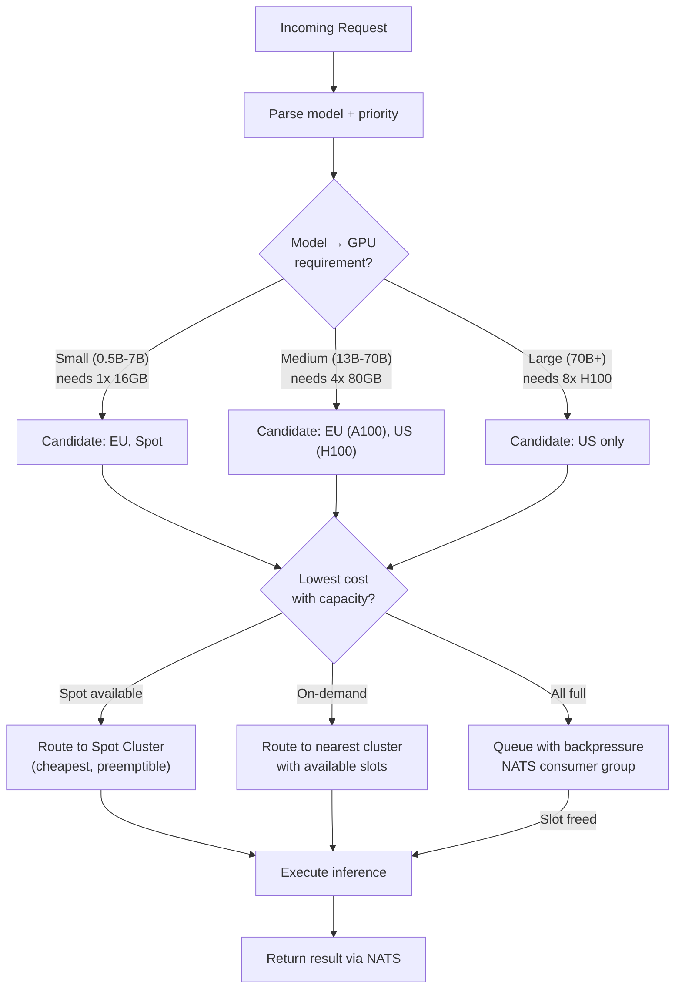

# Architecture

## Current Architecture

What we actually built and deployed.

```mermaid
graph TB
    subgraph Internet
        User["User / Client"]
    end

    subgraph Hetzner["Hetzner Cloud — utility-server (203.0.113.10)"]
        subgraph K3sServer["K3s Server (control plane)"]
            API_SERVER["K8s API Server"]
        end

        subgraph ArgoCD_NS["Namespace: argocd"]
            ARGOCD["ArgoCD<br/>App of Apps pattern<br/>GitHub App auth"]
        end

        subgraph Monitoring_NS["Namespace: monitoring"]
            PROM["Prometheus<br/>30d retention, 50Gi PVC"]
            GRAFANA["Grafana<br/>Infinity plugin, 10Gi PVC"]
            ALERT["AlertManager<br/>10Gi PVC"]
            KSM["kube-state-metrics"]
            NODE_EXP["node-exporter"]
        end

        subgraph GPU_WL["Namespace: gpu-workloads"]
            GPU_API["GPU API (Go)<br/>NodePort 30800<br/>Priority queue (heap)<br/>API key auth"]
            DRAGONFLY["Dragonfly v1.35<br/>Redis-compatible<br/>1Gi mem, 5Gi PVC<br/>RDB snapshots/min"]
            RAY_HEAD["Ray Head<br/>ray-llm:2.53.0<br/>Serve proxy (no GPU)<br/>Dashboard :8265"]
            KUBERAY["KubeRay Operator"]
            DFOP["Dragonfly Operator"]
        end

        subgraph KubeSys["Namespace: kube-system"]
            NFD["Node Feature Discovery<br/>Labels GPU nodes"]
            LPP["Local Path Provisioner<br/>/opt/kube/data"]
        end

        NDP_SRV["NVIDIA Device Plugin"]
        METRICS_SRV["Metrics Server"]
    end

    subgraph Netbird["Netbird VPN Overlay (wt0 interface)"]
        VPN_TUNNEL["Encrypted tunnel<br/>K3s flannel-iface: wt0<br/>node-ip: VPN IP"]
    end

    subgraph RunPod1["RunPod — gpu-node-01 (203.0.113.20:43508)"]
        subgraph Worker1["Ray Worker Pod"]
            VLLM1["vLLM Replica x2<br/>Qwen2.5-0.5B-Instruct<br/>ray-llm:2.53.0"]
        end
        GPU1["2x RTX 5060 Ti 16GB"]
        DCGM1["DCGM Exporter"]
        NDP1["NVIDIA Device Plugin"]
        NODE_EXP1["node-exporter"]
        MODELS1["/opt/gpu — HuggingFace cache"]
    end

    subgraph RunPod2["RunPod — gpu-node-02 (203.0.113.20:59715)"]
        subgraph Worker2["Ray Worker Pod"]
            VLLM2["vLLM Replica x2<br/>Qwen2.5-0.5B-Instruct<br/>ray-llm:2.53.0"]
        end
        GPU2["2x RTX 5060 Ti 16GB"]
        DCGM2["DCGM Exporter"]
        NDP2["NVIDIA Device Plugin"]
        NODE_EXP2["node-exporter"]
        MODELS2["/opt/gpu — HuggingFace cache"]
    end

    %% User flow
    User -->|"POST /v1/batches<br/>X-API-Key header"| GPU_API
    User -->|"GET /v1/batches/{id}"| GPU_API

    %% GPU API internals
    GPU_API -->|"Enqueue job<br/>priority heap"| GPU_API
    GPU_API -->|"Persist job state<br/>DB 1, 7d TTL"| DRAGONFLY
    GPU_API -->|"POST /v1/completions<br/>via serve-svc:8000"| RAY_HEAD

    %% Ray cluster
    RAY_HEAD -->|"Route to vLLM replica"| VLLM1
    RAY_HEAD -->|"Route to vLLM replica"| VLLM2
    RAY_HEAD -->|"GCS fault tolerance<br/>DB 0"| DRAGONFLY
    VLLM1 --> GPU1
    VLLM2 --> GPU2
    VLLM1 --> MODELS1
    VLLM2 --> MODELS2

    %% Networking
    K3sServer <-->|"K3s control plane"| VPN_TUNNEL
    VPN_TUNNEL <-->|"K3s agent join"| RunPod1
    VPN_TUNNEL <-->|"K3s agent join"| RunPod2

    %% Operators
    KUBERAY -->|"Manages RayService CRD"| RAY_HEAD
    DFOP -->|"Manages Dragonfly CR"| DRAGONFLY

    %% Monitoring
    PROM -->|"Scrape /metrics"| GPU_API
    PROM -->|"Scrape"| DCGM1
    PROM -->|"Scrape"| DCGM2
    PROM -->|"Scrape"| RAY_HEAD
    PROM -->|"Scrape"| KSM
    PROM -->|"Scrape"| NODE_EXP
    PROM -->|"Scrape"| NODE_EXP1
    PROM -->|"Scrape"| NODE_EXP2
    GRAFANA -->|"Query"| PROM
    GRAFANA -->|"Infinity plugin<br/>query GPU API"| GPU_API

    %% GitOps
    ARGOCD -->|"Auto-sync from Git"| GPU_WL
    ARGOCD -->|"Auto-sync from Git"| Monitoring_NS
    ARGOCD -->|"Auto-sync from Git"| KubeSys

    %% NFD chain
    NFD -->|"Adds label<br/>nvidia.com/gpu.present"| RunPod1
    NFD -->|"Adds label<br/>nvidia.com/gpu.present"| RunPod2

    style Hetzner fill:#1a1a2e,color:#fff
    style RunPod1 fill:#0f3460,color:#fff
    style RunPod2 fill:#0f3460,color:#fff
    style Netbird fill:#533483,color:#fff
    style GPU_API fill:#e94560,color:#fff
    style RAY_HEAD fill:#16213e,color:#fff
    style DRAGONFLY fill:#0f3460,color:#fff
```



### Request Flow (Current)



### Infrastructure Layers

```
┌─────────────────────────────────────────────────────────────────────┐
│ Layer 4: Applications (deployed by ArgoCD auto-sync)                │
│                                                                     │
│  GPU API → RayService (vLLM) → Dragonfly                           │
│  4 vLLM replicas across 2 workers, 4 GPUs total                    │
│  In-process priority queue (high=1000, medium=500, low=100)         │
│  Max 120 concurrent requests to vLLM                                │
├─────────────────────────────────────────────────────────────────────┤
│ Layer 3: Operators & Platform Services                              │
│                                                                     │
│  KubeRay Operator    → manages RayService CRD                       │
│  Dragonfly Operator  → manages Dragonfly CR                         │
│  NVIDIA Device Plugin → advertises nvidia.com/gpu resources          │
│  Node Feature Discovery → detects GPUs, labels nodes                │
│  Local Path Provisioner → dynamic PVs at /opt/kube/data             │
├─────────────────────────────────────────────────────────────────────┤
│ Layer 2: Monitoring & Observability                                 │
│                                                                     │
│  Prometheus (30d, 50Gi) ← GPU API metrics, DCGM, node-exporter,    │
│                           kube-state-metrics, Ray head/workers      │
│  Grafana ← Infinity plugin for GPU API, Custom + Ray dashboards     │
│  AlertManager                                                       │
├─────────────────────────────────────────────────────────────────────┤
│ Layer 1: GitOps (ArgoCD)                                            │
│                                                                     │
│  App of Apps: bootstrap ApplicationSet → 11 ApplicationSets         │
│  GitHub App auth to private repo                                    │
│  Auto-sync + auto-prune                                             │
├─────────────────────────────────────────────────────────────────────┤
│ Layer 0: Infrastructure (Ansible)                                   │
│                                                                     │
│  K3s v1.35 (disabled: traefik, servicelb, local-storage)            │
│  Netbird VPN overlay (wt0) — all K3s traffic over encrypted tunnel  │
│  NVIDIA Container Toolkit + containerd runtime                      │
│  1 server (Hetzner) + 2 GPU agents (RunPod, 2x RTX 5060 Ti each)   │
└─────────────────────────────────────────────────────────────────────┘
```

---

## Future Architecture — Multi-Datacenter GPU Federation

Where this could go: multiple clusters, multiple GPU types, multiple regions.

```mermaid
graph TB
    subgraph Global["Global Control Plane"]
        GATEWAY["API Gateway<br/>Rate limiting, auth, routing"]
        NATS["NATS JetStream<br/>Cross-cluster job bus"]
        GLOBAL_DB["PostgreSQL<br/>Audit trail, billing,<br/>long-term job history"]
        SCHEDULER["Global Scheduler<br/>Cost-aware routing<br/>GPU type matching<br/>Locality preference"]
        REGISTRY["Model Registry<br/>S3/MinIO<br/>Model versions, weights"]
    end

    subgraph Users["Clients"]
        U1["Batch API Client"]
        U2["Real-time API Client"]
        U3["Internal Services"]
    end

    U1 -->|"POST /v1/batches"| GATEWAY
    U2 -->|"POST /v1/completions"| GATEWAY
    U3 -->|"gRPC"| GATEWAY

    GATEWAY --> SCHEDULER
    SCHEDULER -->|"Route by GPU type,<br/>cost, latency"| NATS
    GATEWAY -->|"Job metadata"| GLOBAL_DB

    subgraph EU_Cluster["EU Cluster — Hetzner (Frankfurt)"]
        EU_API["GPU API"]
        EU_ARGOCD["ArgoCD"]
        EU_DRAGONFLY["Dragonfly"]
        EU_PROM["Prometheus + Grafana"]

        subgraph EU_Ray["RayService — Qwen2.5-0.5B"]
            EU_HEAD["Ray Head"]
            EU_W1["Worker: 2x RTX 5060 Ti"]
            EU_W2["Worker: 2x RTX 5060 Ti"]
        end

        subgraph EU_Ray2["RayService — Llama 3.1 70B"]
            EU_HEAD2["Ray Head"]
            EU_W3["Worker: 4x A100 80GB"]
            EU_W4["Worker: 4x A100 80GB"]
        end
    end

    subgraph US_Cluster["US Cluster — Lambda Labs (Texas)"]
        US_API["GPU API"]
        US_ARGOCD["ArgoCD"]
        US_DRAGONFLY["Dragonfly"]
        US_PROM["Prometheus + Grafana"]

        subgraph US_Ray["RayService — Qwen2.5-72B"]
            US_HEAD["Ray Head"]
            US_W1["Worker: 8x H100"]
            US_W2["Worker: 8x H100"]
        end

        subgraph US_Ray2["RayService — Whisper Large v3"]
            US_HEAD2["Ray Head"]
            US_W3["Worker: 2x A10G"]
        end
    end

    subgraph Spot_Cluster["Spot Cluster — RunPod (burst)"]
        SPOT_API["GPU API"]
        SPOT_ARGOCD["ArgoCD"]

        subgraph Spot_Ray["RayService — Qwen2.5-0.5B (spot)"]
            SPOT_HEAD["Ray Head"]
            SPOT_W1["Spot Worker: 2x RTX 4090"]
            SPOT_W2["Spot Worker: 2x RTX 4090"]
            SPOT_W3["Spot Worker: 2x RTX 4090"]
        end
    end

    %% NATS distributes jobs to clusters
    NATS -->|"Small model jobs<br/>(low latency)"| EU_API
    NATS -->|"Large model jobs<br/>(high VRAM)"| US_API
    NATS -->|"Overflow / burst<br/>(preemptible)"| SPOT_API

    %% Each cluster manages its own Ray
    EU_API --> EU_HEAD
    EU_API --> EU_HEAD2
    EU_API --> EU_DRAGONFLY
    US_API --> US_HEAD
    US_API --> US_HEAD2
    US_API --> US_DRAGONFLY
    SPOT_API --> SPOT_HEAD

    %% Results flow back
    EU_API -->|"Results"| NATS
    US_API -->|"Results"| NATS
    SPOT_API -->|"Results"| NATS
    NATS -->|"Results"| GATEWAY

    %% Model distribution
    REGISTRY -->|"Pull weights"| EU_Ray
    REGISTRY -->|"Pull weights"| EU_Ray2
    REGISTRY -->|"Pull weights"| US_Ray
    REGISTRY -->|"Pull weights"| US_Ray2
    REGISTRY -->|"Pull weights"| Spot_Ray

    %% Monitoring federation
    EU_PROM -->|"Remote write"| GLOBAL_DB
    US_PROM -->|"Remote write"| GLOBAL_DB

    style Global fill:#1a1a2e,color:#fff
    style EU_Cluster fill:#0f3460,color:#fff
    style US_Cluster fill:#16213e,color:#fff
    style Spot_Cluster fill:#533483,color:#fff
    style GATEWAY fill:#e94560,color:#fff
    style NATS fill:#e94560,color:#fff
    style SCHEDULER fill:#e94560,color:#fff
```



### What Changes from Current to Future

| Concern | Current | Future |
|---|---|---|
| **Job routing** | Single GPU API with in-process queue | Global scheduler routes by GPU type, cost, latency |
| **Cross-cluster comms** | N/A (single cluster) | NATS JetStream as job bus between clusters |
| **Storage** | Dragonfly (Redis) for job state + GCS | PostgreSQL for audit/billing + Dragonfly per cluster |
| **Models** | Single model (Qwen2.5-0.5B), hostPath cache | Model registry (S3/MinIO), multiple models per cluster |
| **GPU types** | Homogeneous (4x RTX 5060 Ti) | Heterogeneous (RTX, A100, H100, spot instances) |
| **Scaling** | Fixed 2 workers, 4 replicas | Per-cluster autoscaling + spot burst cluster |
| **Networking** | Netbird VPN between 3 nodes | WireGuard mesh or Tailscale between clusters, Netbird within |
| **Monitoring** | Single Prometheus + Grafana | Federated Prometheus, global dashboards via remote write |
| **Auth** | Single API key | Multi-tenant with per-user keys, rate limits, quotas |
| **HA** | Head SPOF, single Dragonfly | Ray head HA via GCS FT, Dragonfly replication |
| **Cost** | Fixed RunPod instances | Spot preemption handling, cost-per-token tracking |

### Future: Job Routing Logic


